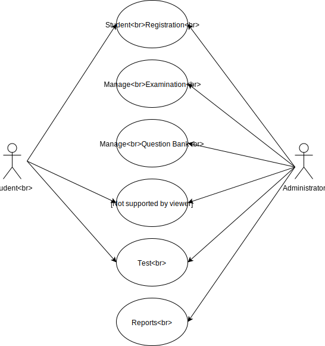

# Project: Online Student Registration System

**Type**: Web

**Technology**: ASP.NET Core, JavaScript, SQlite

The Online Student Registration System is an Web Based portal developed in ASP.NET Core. Online Registration system will allow online submission of student application, Student Registration, Perform Computer based quiz/test. Store test results, modify student profile. Online Student Registration System Project consist of two functional elements: an enhanced Student module for Registration, Edit Profile, View Test history, Change Password. Online Test/Quiz Module for Start test, give examination, calculate results, Store test results, manage question banks.

---
### Abstract
Currently student submits hardcopy of filled application form to the college/university, office staff enters all data into excel file and write same in manual register. Issue hall tickets/admit card to student and conduct test for student. Student comes to college and give test for the specified date, Office staff check all the paper calculate results and type all the details for taking printout and display it in college premises. COllege inform student to check the result, student comes to college and view the results.

Propose online student resgistration system will eliminate all the manual intervention and increase the speed of whole process. System will allow student to fill the form online, system has inbuilt validation system to validate the entered data. After successful submission, system will give unique registration no for each student. Student can login not system by using registration no and give online test. System will show the result after instantly and stored the results for further use.

---
### Project Requirement
- Online submission of application forms.
- Online Quizess for the first semester courses. Three should be minimum 50 questions(Objective types with four options)
- When user leaves the test its result should be display at that moment.
- There should be proper login system for user where security is required.
- The web techonology to be used: ASP.NET Core, HTML, CSS, Javascript
- The proper validation should be done.

---
### Solution
After analysis the requirement we decide that we need to create following web pages

- Home Page
- Login Page
- My Page Registration
- Change Password
- Edit Profile
- Start Test
- Examination
- Results
- FAQ
- Contact Us

---
### Deployment Environment

- **Database**
	- SQlite

- **Application Server**
	- OS: Windows 7 or up, Linux, Mac OS X
	- HDD: Min 4.5 GB
	- RAM: Min 512 MB, Recommanded 2 GB
	- Processor: Min Dual Core 1 Ghz

- **Workstation**: The Online registration system web application will operate with following Web Browsers: Microsoft IE 11, Microsoft Edge, Firefox, Chrome, Safari, Opera, Vivaldi, Maxthon

---
### Developement Tools and Technologies
- ASP.NET Core
- SQlite
- VS Code/Sublime Text Editor/Atom

---
### Online Student Registration System Use Case

